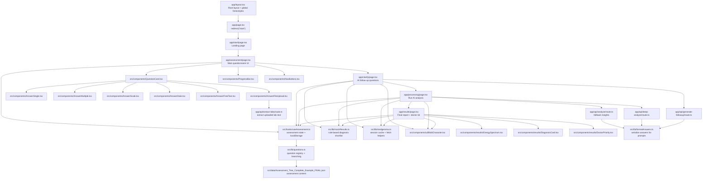
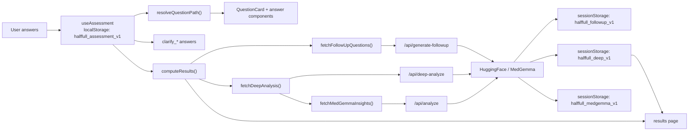

# Frontend Connection Graph

This graph shows how the main pieces in `frontend/` connect today.

## Main Runtime Graph

## Data Flow

## File Roles

- `frontend/app/*`: active App Router pages and API routes.
- `frontend/src/hooks/useAssessment.ts`: shared assessment state, localStorage persistence, path recalculation, reset.
- `frontend/src/lib/questions.ts`: turns the assessment tree JSON into runtime questions and branching logic.
- `frontend/src/lib/mockResults.ts`: current rule-based scoring and doctor recommendations used before / alongside backend ML.
- `frontend/src/lib/medgemma.ts`: fetch helpers and session-storage caching for AI outputs.
- `frontend/src/lib/formatAnswers.ts`: common serializer used by the API routes to turn raw answers into prompt text.
- `frontend/src/components/*`: reusable input and presentation components.
- `frontend/src/components/results/*`: result-specific cards and visual summaries.
- `frontend/src/data/Assessment_Tree_Complete_Example_FINAL.json`: question content source consumed by `questions.ts`.

## Important Structural Note

- There are duplicate route files under both `frontend/app/` and `frontend/src/app/`.
- The active Next.js App Router entrypoint is `frontend/app/`.
- `frontend/src/app/` looks like an older parallel copy or prototype layer and is not the primary runtime path if `frontend/app/` is being served.
