# Frontend Connection Graph

This file documents the current runtime structure in `frontend/`.

## Main Runtime Graph

```mermaid
flowchart TD
    Root["app/layout.tsx\nRoot layout + global styles"] --> Home["app/page.tsx\nredirect('/start')"]
    Home --> Start["app/start/page.tsx\nLanding page"]
    Start --> Consent["app/consent/page.tsx\nPrivacy consent"]
    Consent --> Assessment["app/assessment/page.tsx\nMain questionnaire UI"]
    Assessment --> Clarify["app/clarify/page.tsx\nBayesian follow-up questions"]
    Clarify --> Processing["app/processing/page.tsx\nRun analysis"]
    Processing --> Results["app/results/page.tsx\nFinal report"]

    Assessment --> UseAssessment["src/hooks/useAssessment.ts\nsession state + navigation"]
    Clarify --> UseAssessment
    Processing --> UseAssessment
    Results --> UseAssessment

    UseAssessment --> QuestionsLib["src/lib/questions.ts\nquestion registry + path resolution"]
    QuestionsLib --> TreeJson["src/data/quiz_nhanes_v2.json\nactive assessment content"]

    Assessment --> QuestionCard["src/components/QuestionCard.tsx"]
    Assessment --> QuestionGroupCard["src/components/QuestionGroupCard.tsx"]
    Assessment --> ProgressBar["src/components/ProgressBar.tsx"]
    Assessment --> NavButtons["src/components/NavButtons.tsx"]

    QuestionCard --> AnswerSingle["src/components/AnswerSingle.tsx"]
    QuestionCard --> AnswerMultiple["src/components/AnswerMultiple.tsx"]
    QuestionCard --> AnswerNumeric["src/components/AnswerNumeric.tsx"]
    QuestionCard --> AnswerDualNumeric["src/components/AnswerDualNumeric.tsx"]
    QuestionCard --> AnswerDate["src/components/AnswerDate.tsx"]
    QuestionCard --> AnswerFreeText["src/components/AnswerFreeText.tsx"]
    QuestionCard --> AnswerFileUpload["src/components/AnswerFileUpload.tsx"]

    AnswerFileUpload --> ExtractLabs["app/api/extract-labs/route.ts\nextract uploaded PDF/image lab data"]

    Clarify --> MedgemmaLib["src/lib/medgemma.ts\nfetch helpers + storage"]
    Clarify --> MlScoreAPI["app/api/score/route.ts"]
    Clarify --> BayesianQuestions["app/api/bayesian-questions/route.ts"]
    Clarify --> BayesianUpdate["app/api/bayesian-update/route.ts"]

    Processing --> MedgemmaLib
    Processing --> AnalyzeAPI["app/api/analyze/route.ts"]
    Processing --> DeepAnalyze["app/api/deep-analyze/route.ts"]

    Results --> MedgemmaLib
    Results --> ClinicalSignals["src/lib/clinicalSignals.ts"]
    Results --> MockResults["src/lib/mockResults.ts"]
    Results --> Energy["src/components/results/EnergySpectrum.tsx"]
    Results --> Diagnosis["src/components/results/DiagnosisCard.tsx"]
    Results --> Doctor["src/components/results/DoctorPriority.tsx"]

    AnalyzeAPI --> FormatAnswers["src/lib/formatAnswers.ts\nserialize answers for prompts"]
    DeepAnalyze --> FormatAnswers
```

## Data Flow

```mermaid
flowchart LR
    User["User answers"] --> AssessmentState["useAssessment\nsessionStorage: halffull_assessment_v2"]
    AssessmentState --> Path["resolveQuestionPath()"]
    Path --> UI["Assessment UI"]

    AssessmentState --> Upload["lab_upload answer"]
    Upload --> ExtractLabs["/api/extract-labs"]

    AssessmentState --> ScoreFetch["fetchMLScoresWithTimeout()"]
    ScoreFetch --> ScoreAPI["/api/score"]
    ScoreAPI --> ScoreCache["sessionStorage: halffull_ml_scores_v1"]

    ScoreCache --> QuestionFetch["fetchBayesianQuestionsWithTimeout()"]
    QuestionFetch --> QuestionsAPI["/api/bayesian-questions"]
    QuestionsAPI --> QuestionsUI["clarify page"]

    QuestionsUI --> UpdateFetch["fetchBayesianUpdateWithTimeout()"]
    UpdateFetch --> UpdateAPI["/api/bayesian-update"]
    UpdateAPI --> BayesianCache["sessionStorage: halffull_bayesian_*"]

    BayesianCache --> DeepFetch["getDeepAnalysisWithFallback()"]
    DeepFetch --> DeepAPI["/api/deep-analyze"]
    DeepAPI --> DeepCache["sessionStorage: halffull_deep_v1"]

    DeepCache --> Results["results page"]
```

## File Roles

- `frontend/app/*`: active App Router pages and API routes.
- `frontend/src/components/*`: reusable UI components.
- `frontend/src/hooks/useAssessment.ts`: assessment state, storage, screen navigation.
- `frontend/src/lib/questions.ts`: converts quiz JSON into runtime questions and conditional flow.
- `frontend/src/data/quiz_nhanes_v2.json`: active assessment content.
- `frontend/src/lib/medgemma.ts`: API helpers and browser storage helpers for ML/Bayesian/deep-analysis state.
- `frontend/src/lib/formatAnswers.ts`: serializer used by analysis routes.
- `frontend/src/lib/clinicalSignals.ts` and `frontend/src/lib/mockResults.ts`: result shaping and fallback logic.
- `frontend/lib/medgemma-safety.ts`: shared safety/schema utility used by server routes.

## Important Structural Note

- `frontend/app/` is the only route tree.
- `frontend/src/` contains shared code, not pages.
- The old duplicate `frontend/src/app/` tree has been removed.
